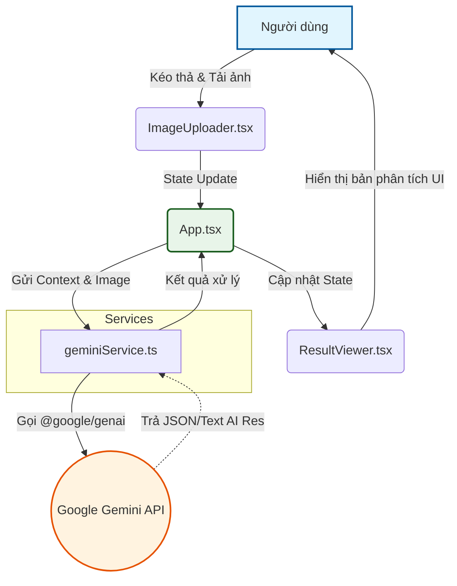

<div align="center">
</div>

# AI-Banner-Pro (Banner Clone Pro)

## 📌 Giới thiệu (Introduction)
Dự án AI-Banner-Pro (tên gói: `bannerclone-pro`) là một ứng dụng web được xây dựng bằng React 19, Vite và TypeScript, tích hợp công nghệ trí tuệ nhân tạo Gemini API mới nhất của Google (`@google/genai`). 

Ứng dụng cung cấp các tính năng tải ảnh giao diện hoặc banner, sử dụng AI để nhận diện, phân tích hình ảnh và trả về kết xuất (như prompt, code hoặc các phần tử chi tiết), sau đó hiển thị kết quả một cách trực quan trên giao diện ứng dụng.

## 🚀 Phân tích dự án (Project Analysis)
Dự án áp dụng mô hình kiến trúc Component-Based và Service-Oriented (phân tách giao diện và tác vụ ngoại vi).

**Thành phần cấu trúc chính:**
- **Thư mục `components/`**:
  - `ImageUploader.tsx`: Thành phần nhận file ảnh đầu vào (kéo/thả hoặc tìm kiếm từ thiết bị), chịu trách nhiệm preview và đẩy file lên luồng xử lý chính.
  - `ResultViewer.tsx`: Thành phần giao diện được thiết kế để hiển thị kết quả phân tích hoặc banner clone theo cách rõ ràng, trực quan.
- **Thư mục `services/`**:
  - `geminiService.ts`: Module chứa logic chính để kết nối với Google Gemini API. Nó cấu hình client genai, quản lý các prompt đặc tả, gửi ảnh lên model phân tích và đóng gói kết quả phản hồi.
- **Cốt lõi (Core)**: 
  - `App.tsx`: Trái tim của ứng dụng điều phối state quản lý dữ liệu file uploader và truyền tải prop tương ứng tới component results viewer sau khi nhận hồi đáp từ service AI.
  - `types.ts`: Cấu trúc định nghĩa kiểu dữ liệu chặt chẽ cho toàn dự án.

## 📊 Sơ đồ kiến trúc (Architecture Graph)



## 🛠 Hướng dẫn cài đặt và chạy cục bộ (Installation & Setup)

**Yêu cầu hệ thống:**
- Node.js (phiên bản hỗ trợ TypeScript & Vite)
- NPM, Yarn, hoặc PNPM

**Các bước tiến hành:**

1. **Cài đặt các gói thư viện (Dependencies):**
   Mở terminal tại thư mục mã nguồn và chạy lệnh theo trình quản lý package của bạn:
   ```bash
   npm install
   ```

2. **Thiết lập biến môi trường:**
   Tạo mới (hoặc chỉnh sửa) tệp `.env.local` ở thư mục gốc của dự án. Cung cấp API key từ Google Gemini của bạn. Tên biến có thể là `GEMINI_API_KEY` (hoặc tuỳ thuộc vào biến bạn gọi ở `geminiService`):
   ```env
   VITE_GEMINI_API_KEY="thêm_API_KEY_của_bạn_tại_đây"
   ```

3. **Chạy máy chủ phát triển (Development Server):**
   Khởi động dev server bằng lệnh sau:
   ```bash
   npm run dev
   ```
   *Sau lệnh này, truy cập vào đường dẫn `http://localhost:5173` để dùng thử ứng dụng.*

4. **Biên dịch để xuất bản (Build for Production):**
   Nếu muốn triển khai sản phẩm, chạy lệnh xây dựng nội dung tĩnh:
   ```bash
   npm run build
   ```

---
*Xem ứng dụng của bạn trong AI Studio: [AI Studio App Link](https://ai.studio/apps/8c8fe728-724a-403f-b53e-3f3e63891e29)*
